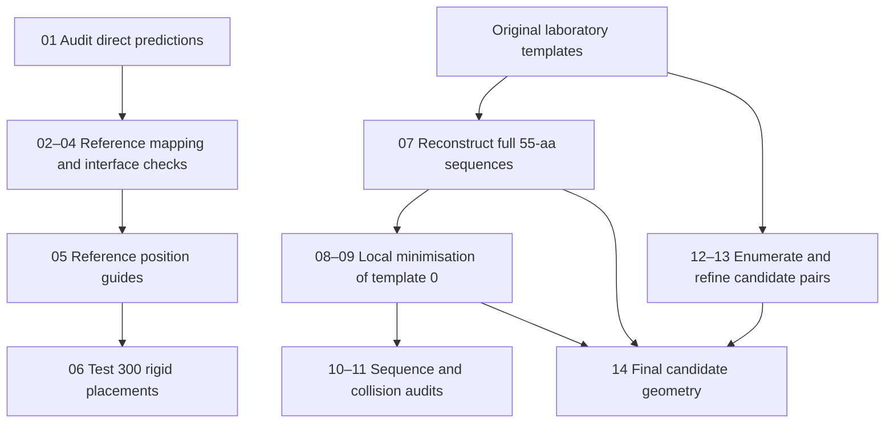

# ADDomer adapter structural analysis

Core research scripts for auditing a 55-residue adapter–penton complex, constructing reference-guided models and assessing two exploratory disulfide candidates. The complex contains five 543-residue penton chains and three adapters.

This repository contains **14 numbered analysis scripts and 2 shared modules**. It focuses on the revised 55-aa analysis underlying the report. Historical 50-aa HPC experiments, repeated server-run comparisons, manuscript generators and presentation scripts are outside this core export.

## Study design

| Dataset | Role |
|---|---|
| Five direct 55-aa Protenix samples, seed 79470 | Sequence, confidence and interface audits |
| Original laboratory 52-aa ensemble, seed 64438 | Reference comparison and reconstruction templates |
| Experimental complex 1X9T | Sequence correspondence and local peptide-position guides |
| Five reconstructed 55-aa templates | Candidate geometry checks |
| Locally minimised template 0 | Independent sequence, connectivity and overlap checks; candidate reassessment |

The original laboratory reference must not be replaced with a later rerun using the same seed.

## Repository contents

- `scripts/` — numbered analysis entry points; files beginning with `_` are shared helpers.
- `docs/RUN_ORDER.md` — purpose, inputs, commands and outputs for each step.
- `docs/INPUTS_AND_SOFTWARE.md` — data placement, software and execution environments.
- `docs/METHODS_AND_LIMITATIONS.md` — interpretation limits, exclusions and export corrections.
- `metadata/` — source-code provenance and checks performed on this export.

Generated `data/` and `results/` directories are ignored by Git. They are not part of the upload package.

## Workflow overview



Step 06 is a diagnostic branch: its rigid placements did not establish acceptable binding models and are not inputs to template reconstruction.

## Quick start

Run commands in a **terminal on a local computer or computational server**. GitHub hosts the code; it does not execute these calculations. PyMOL's graphical command prompt is not the general Python terminal used below.

```bash
cd /path/to/addomer-core
python3 -m venv .venv
source .venv/bin/activate
python -m pip install -r requirements.txt
mkdir -p data results
```

Place the original inputs according to [Inputs and software](docs/INPUTS_AND_SOFTWARE.md), then start with:

```bash
python scripts/01_audit_predictions.py
python scripts/02_map_reference.py
```

Follow [Run order](docs/RUN_ORDER.md) for the remaining stages. Steps 07–09 require separate PyMOL/OpenMM environments; the NumPy installation above is not sufficient for those steps. The scripts use project-relative paths. `ADDOMER_WORKDIR` can optionally point to a separate directory containing `data/` and `results/`.

## Interpretation

Direct 55-aa predictions did not recover the selected reference contacts. Template reconstruction reduced severe overlaps but did not independently validate binding. V31C–Q457C and E30C–L223C are conformation-dependent experimental hypotheses, not demonstrated stability improvements. Each passed in three symmetry-related chain pairs of one unrelaxed template; neither passed in the minimised representative.

## Reproducibility

The code preserves the original numerical workflow with documented path and dependency changes. A spacing-sensitive threshold bug in the final geometry check was corrected and rerun; details are in [Methods and limitations](docs/METHODS_AND_LIMITATIONS.md). The validation metadata distinguishes executed analysis checks from reconstruction/minimisation stages not rerun during packaging. This is not a fresh end-to-end reproduction of the Protenix predictions.
